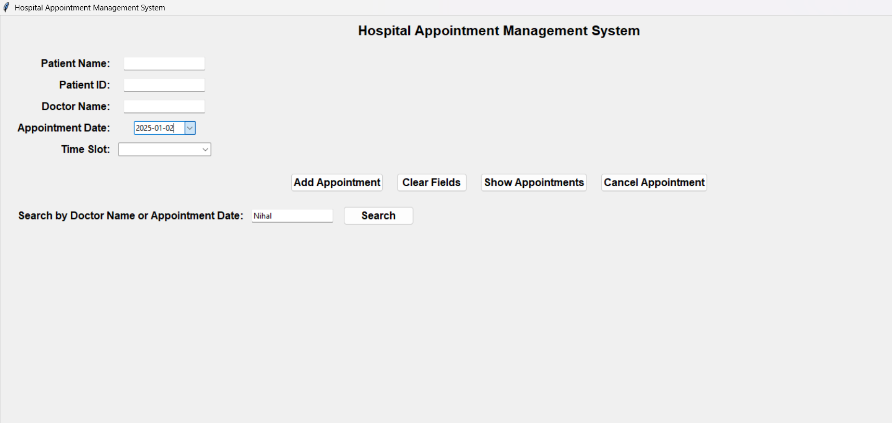

# Hospital Appointment Management System (Tkinter)

## Overview
This is a desktop application built using **Python (Tkinter)** and **SQLite** to manage hospital doctor appointments efficiently. The system allows users to add, view, search, and cancel appointments with error handling to prevent duplicate entries.

## Features
- **Add Appointment:** Register a new appointment with patient details and a unique ID.
- **Show Appointments:** View all appointments in a tabular format.
- **Search Appointments:** Find an appointment by Doctor Name or Date.
- **Cancel Appointment:** Remove an appointment using the Patient ID.
- **Error Handling:** Prevents duplicate Patient IDs and missing required fields.
- **User-Friendly UI:** Built with Tkinter for an easy-to-use interface.

## Database Structure (SQLite)
The database `hospital_data.db` includes a table **appointments** with the following columns:

- `appointment_id`
- `patient_id`
- `patient_name`
- `doctor_name`
- `appointment_date`
- `time_slot`

## Screenshots

### Interface Added Successfully


### Prerequisites
Ensure you have **Python 3** installed. Install the required dependencies using:
```sh
pip install tkcalendar
